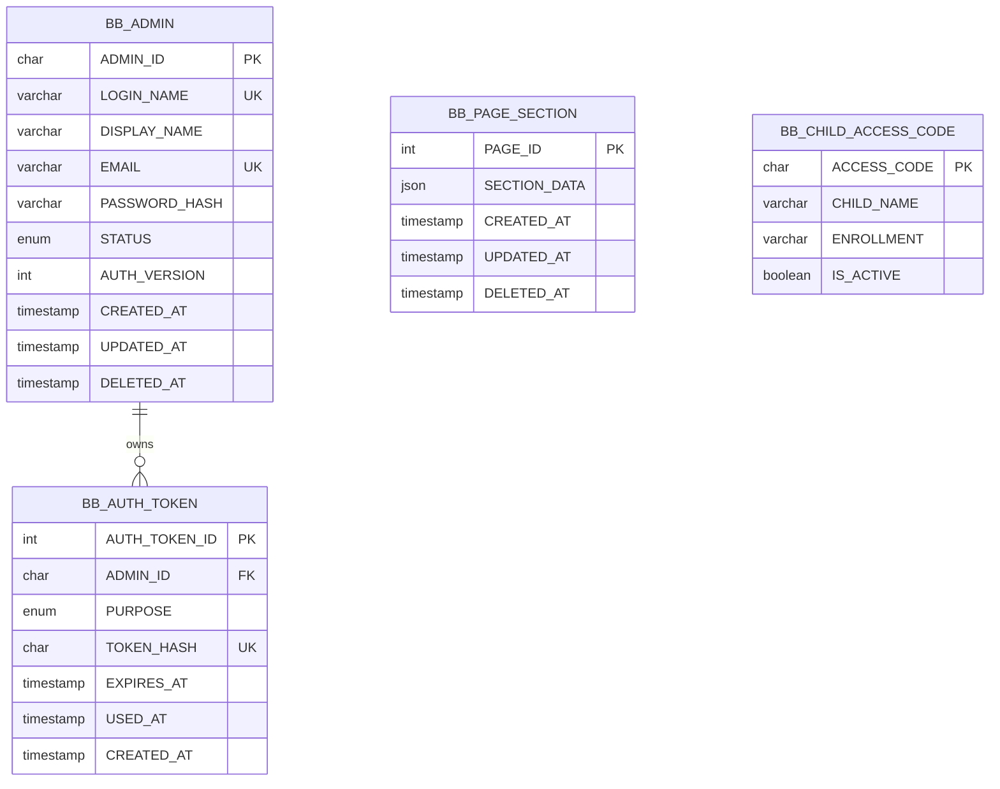

# BotBuilder ERD — Admin-only architecture

`BB_PAGE_SECTION` and `BB_CHILD_ACCESS_CODE` are managed by an authenticated admin but have no required database foreign key to the admin account. The public landing page reads page sections without authentication.
